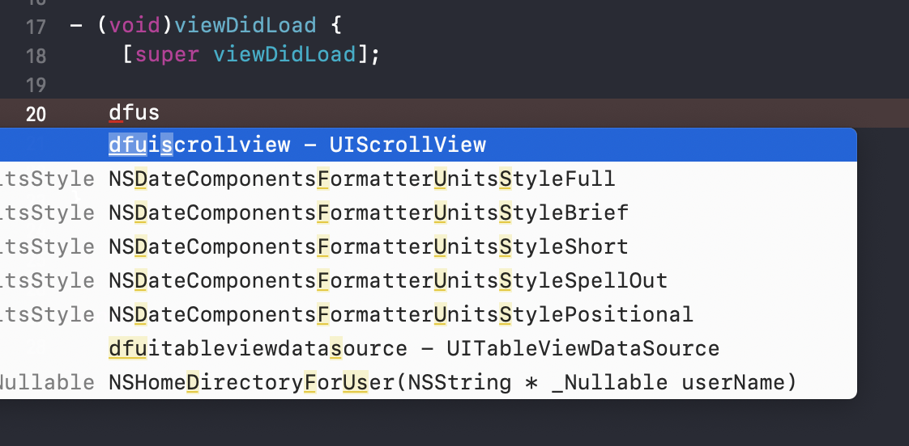
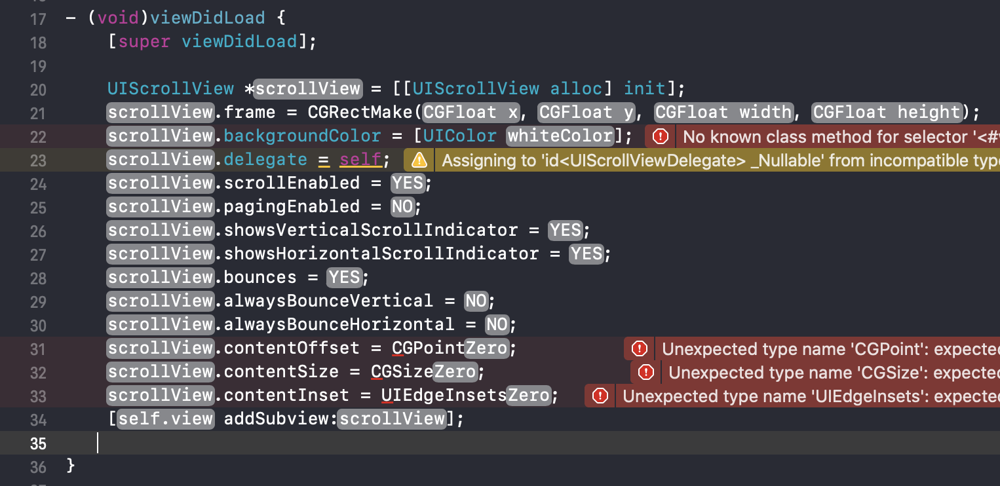
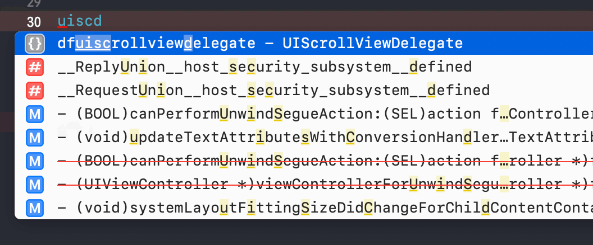
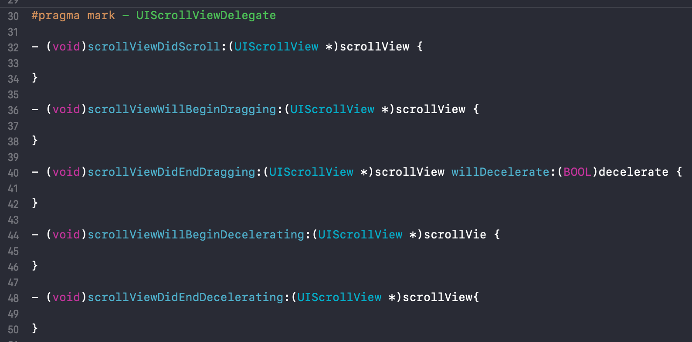

# 


### DFCodeBlocks是一个Xcode的代码块合集，常用代码再也不用一遍一遍地敲了!
<br>
❀❀❀❀❀❀❀❀❀❀❀❀❀❀❀❀❀❀❀❀❀❀❀❀❀❀❀❀❀❀❀❀❀❀❀❀❀❀❀❀❀❀❀❀❀❀❀❀❀❀❀❀❀❀❀❀❀❀

#### 想写一个UIScrollView？键盘输入"快捷键"中的dfus等关键字符,会有如图提示：


#### 按下回车，会得到：


#### 像做填空题一样写代码，简直不要太爽啊！
#### 什么？还要写代理？So Easy！！！
#### 键盘输入关键字：


#### 回车：


#### 写代码也太快太简单了吧😁

<br>

## 支持：
#### 目前包含Objective-C和swift两种语言，仍在不断更新中...
#### ps：shortcut key即快捷键，命名方法是df+控件名小写。加df前缀可避免与控件原代码提示冲突。

| CodeBlock                          | Objective-C | Swift | shortcut key |   
| ---------------------------------- |:-:| :-:| ------ |
| @property                          | ✔️ | ❌ | property
| mark                               | ✔️ | ✔️ | mark
| todo                               | ❌ | ✔️ | mark
| fixme                              | ❌ | ✔️ | mark
| warning                            | ✔️ | ❌ | warning
| UIViewControllerLifeCycle          | ✔️ | ✔️ | dfvclifecycle
| UIView                             | ✔️ | ❌ | dfuiview
| UIButton                           | ✔️ | ❌ | dfuibutton
| UILabel                            | ✔️ | ❌ | dfuilabel
| UIImageView                        | ✔️ | ❌ | dfuiimageview
| UITextField                        | ✔️ | ❌ | dfuitextfield
| UITextFieldDelegate                | ✔️ | ❌ | dfuitextfielddelegate
| UITextView                         | ✔️ | ❌ | dfuitextview
| UITextViewDelegate                 | ✔️ | ❌ | dftextviewdelegate
| UIScrollView                       | ✔️ | ❌ | dfuiscrollview
| UIScrollViewDelegate               | ✔️ | ❌ | dfuiscrollviewdelegate
| UITableView                        | ✔️ | ❌ | dfuitableview
| UITableViewDelegate                | ✔️ | ❌ | dfuitableviewdelegate
| UITableViewDataSource              | ✔️ | ❌ | dfuitableviewdatasource
| UIPickerView                       | ✔️ | ❌ | dfuipickerview
| UIPickerViewDelegate               | ✔️ | ❌ | dfuipickerviewdelegate
| UIPickerViewDataSource             | ✔️ | ❌ | dfuipickerviewdatasource
| UIWindow                           | ✔️ | ❌ | dfuiwindow
| UICollectionView                   | ✔️ | ✔️ | dfuicollectionview
| UICollectionViewDataSource         | ✔️ | ✔️ | dfuicollectionviewdatasource
| UICollectionViewDelegate           | ✔️ | ✔️ | dfuicollectionviewdelegate
| UICollectionViewDelegateFlowLayout | ✔️ | ✔️ | dfuicollectionviewdelegateflowlayout


<br>

## 使用：
1、下载，并复制CodeSnippets文件夹下的所有文件
<br>
2、在mac的finder中前往文件夹地址：
```
~/Library/Developer/Xcode/UserData/CodeSnippets
```
3、将第一步复制的内容，粘贴到第二步的地址下，重启Xcode

<br>

## 建议：

我认为这是一件有趣的事情，如果有好的代码块建议，在<a href="https://github.com/ihoudf/DFCodeBlocks/issues" target="blank">这里</a>提交，参与者将列举在这。